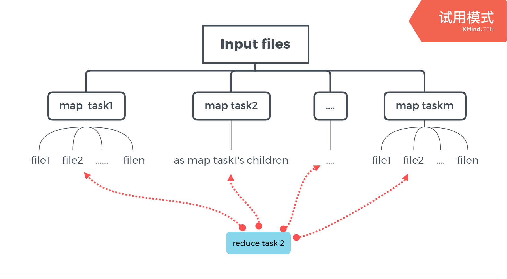

## MapReduce

------

**1**. The application provides the input files, a map function, a reduce function and the reduce tasks (nReduce)

**2**. A master starts an RPC server,  and waits for workers to register. Then assign tasks to workers, and handle worker failures

**3**. The master considers **each input file to be one map task**, and calls doMap() to process each map task, then **produces n intermediate files.**

**4**. The master next calls doReduce() to process reduce task.  **Reduce task r collects the r'th intermediate file from each map task.**

**5**. The master merges all the n files produced by 4 into  a single output.

**6**. The master sends a Shutdown RPC to each worker and shuts down its own RPC server.

